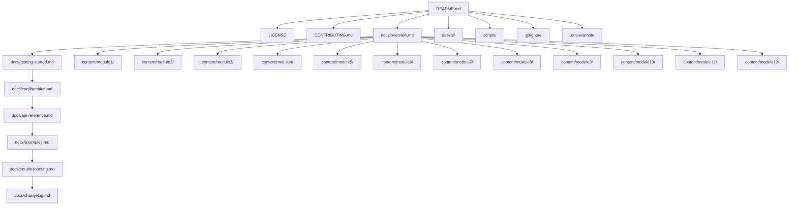

# ppc-tools-for-va - Code Dependency Graph

```mermaid
graph TD
    N0["README.md"]
    N1["LICENSE"]
    N2["CONTRIBUTING.md"]
    N3["docs/overview.md"]
    N4["docs/getting-started.md"]
    N5["docs/configuration.md"]
    N6["docs/api-reference.md"]
    N7["docs/examples.md"]
    N8["docs/troubleshooting.md"]
    N9["docs/changelog.md"]
    N10["content/module1/"]
    N11["content/module2/"]
    N12["content/module3/"]
    N13["content/module4/"]
    N14["content/module5/"]
    N15["content/module6/"]
    N16["content/module7/"]
    N17["content/module8/"]
    N18["content/module9/"]
    N19["content/module10/"]
    N20["content/module11/"]
    N21["content/module12/"]
    N22["assets/"]
    N23["scripts/"]
    N24[".gitignore"]
    N25[".env.example"]
    N0 --> N1
    N0 --> N2
    N0 --> N3
    N3 --> N4
    N4 --> N5
    N5 --> N6
    N6 --> N7
    N7 --> N8
    N8 --> N9
    N3 --> N10
    N3 --> N11
    N3 --> N12
    N3 --> N13
    N3 --> N14
    N3 --> N15
    N3 --> N16
    N3 --> N17
    N3 --> N18
    N3 --> N19
    N3 --> N20
    N3 --> N21
    N0 --> N22
    N0 --> N23
    N0 --> N24
    N0 --> N25
```